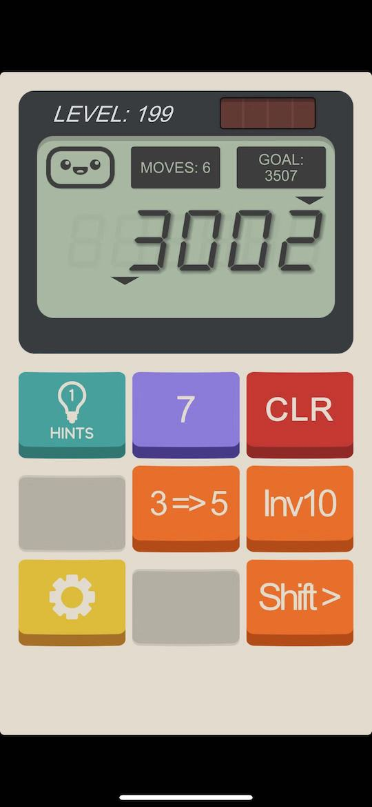
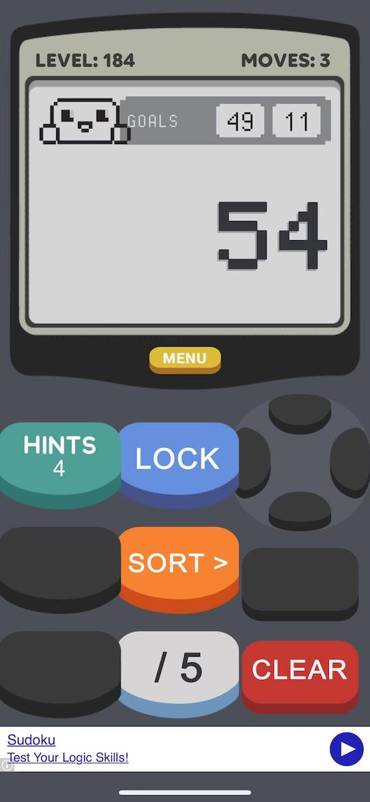

# Puzzle Solver for Calculator: The Game

This project provides a puzzle solver (solution finder) for the game
[Calculator: The Game](https://itunes.apple.com/us/app/calculator-the-game/id1243055750?mt=8)
and [Calculator 2: The Game](https://itunes.apple.com/us/app/calculator-2-the-game/id1436348748?mt=8).

It uses a backtracking algorithm to try to find one possible solution (might not be the simplest)
for the given puzzle.

The algorithm is written in Python v3.7+.

## Command Line Usage

``` console
$ ./calculator-solver.py -h
usage: calculator-solver.py [-h] -g GOAL [GOAL ...] -m MOVES [-t TOTAL] -b
                            BUTTON [BUTTON ...] [-p LEFT RIGHT]

Calculator: The Game - Puzzle Solver

optional arguments:
  -h, --help            show this help message and exit
  -g GOAL [GOAL ...], --goals GOAL [GOAL ...]
                        the goal number(s) or password(s)
  -m MOVES, --moves MOVES
                        the number of moves can make
  -t TOTAL, --total TOTAL
                        the initial total number
  -b BUTTON [BUTTON ...], --buttons BUTTON [BUTTON ...]
                        the buttons
  -p LEFT RIGHT, --portals LEFT RIGHT
                        portal range (zero based)
```

For more details, check [doc](./doc).

## Example

### v1 Level 199



``` console
$ ./calculator-solver.py -m 6 -g 3507 -t 3002 -b '3=>5' '>' 7 inv10 -p 4 0
goal: 3507
350 7 -> 3507
750 Inv10 -> 350
507 Shift> -> 750
50 7 -> 507
30 3=>5 -> 50
3002 7 -> 30
```

So the solution move sequence is: `7`, `3=>5`, `7`, `Shift>`, `Inv10`, `7`.

### v2 Level 184



``` console
$ ./calculator-solver.py -m 3 -g 49 11 -t 54 -b /5 '>' lock
goal: 49
45 /5 -> 49
45 LOCK{'pos': 1} -> 45
54 Shift> -> 45

goal: 11
55 /5 -> 11
54 Shift> -> 55
54 LOCK{'pos': 1} -> 54
```

The solution move sequence for goal **49** is: `Shift>`, `LOCK` (press `<` once), `/5`;
for goal **11** is: `LOCK` (press `<` once), `Shift>`, `/5`.
